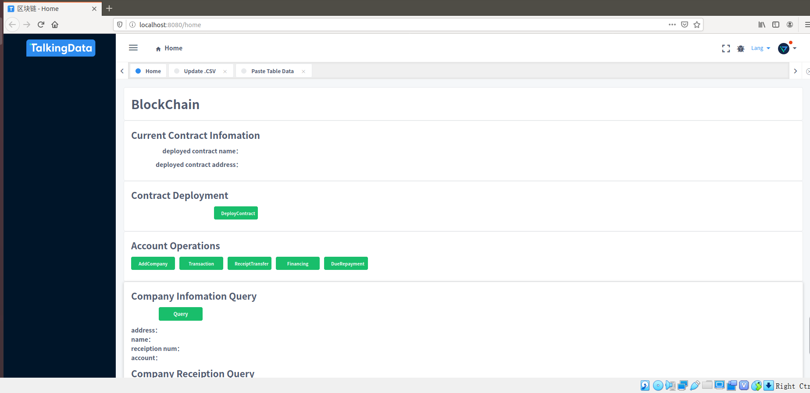

# ChainBlock

- 服务端，back文件夹，使用fisco-bcos教程中提到的nodejs实现。
  - `packges/cli/contracts`中存放要部署的合约文件，Trust.sol。
  - `packges/cli/app.js`为后端的js API文件。
  
- 客户端，front文件夹，使用iview-admin模板。
  - `src/view/home.home.vue`存放前端vue文件。
  
  
  
- 使用
  - 在服务端文件夹`back`中，按照fisco-bcos教程，配置config文件。
  ```
  //下载依赖
  npm install
  npm run repoclean
  npm run bootstrap
  ```
  - 在packages文件夹下，运行如下指令
  ```
  node app.js
  
  后端开启会有如下监听显示：
    listen 3000
  ```
  
  - 在客户端文件夹`front`中，请教同学得知可用iview admin框架。
  在文件夹中运行如下指令
  ```
  npm install
  npm run dev
  ```
  运行成功会打开浏览器`localhost：8080`。


- 浏览器界面如下：

